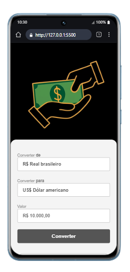

# 🔄  Conversor de Moedas (Projeto–Conversor–JS)

Um site simples de conversão de moedas criado com **HTML**, **CSS** e **JavaScript**, para treinar DOM e lógica básica.

---

## 🖼 Visualização do Projeto



---

## 🚀 Funcionalidades

- 💱 Conversão entre diferentes moedas
- 📥 Entrada de valor personalizada
- 🔄 Atualização automática do resultado
- 🎯 Interface simples e responsiva

---

## 🛠 Tecnologias utilizadas

- **HTML5** → Estrutura da página  
- **CSS3** → Estilização da interface  
- **JavaScript (Vanilla JS)** → Lógica de conversão e manipulação de dados  

---

## ▶️ Como abrir e executar o projeto

Você pode abrir e testar o projeto de forma super simples, sem precisar instalar nada:

### 🔧 Requisitos

- Um navegador moderno (como **Google Chrome**, **Firefox**, **Edge**, **Safari**, etc.)
- Editor de código (opcional, mas recomendado: **VS Code**, **Sublime Text**, **Atom**, etc.)

### 📦 Passo a passo

1. **Clone ou baixe o repositório:**

   ```bash
   git clone https://github.com/Klausdmkb/Projeto--Conversor--JS.git
   ```
   
Ou clique em Code > Download ZIP e extraia os arquivos.

Abra o projeto:

- Navegue até a pasta onde está o projeto

- Clique duas vezes no arquivo index.html

- O navegador abrirá a aplicação automaticamente

- (Opcional) Edite o código:

- Abra a pasta no seu editor de código favorito

- Explore os arquivos scripts.js e style.css para personalizar ou estudar

---

📌 Melhorias futuras

- 📱 Versão mobile com layout otimizado

- 💾 Histórico de conversões

- 🔔 Notificações de variação de câmbio

---
## 📄 Licença

-Este projeto foi desenvolvido com fins educacionais como parte dos estudos realizados na plataforma **DevClub**, sob orientação do professor **Rodolfo Mori**.

-Você pode utilizar, modificar e compartilhar este código livremente para fins de aprendizado e prática pessoal.  
-Caso deseje utilizar em projetos públicos ou comerciais, recomenda-se manter os créditos originais.

*Todos os direitos de ensino e metodologia pertencem ao DevClub e Rodolfo Mori.*

🚀 Aprenda mais em: [https://devclub.com.br](https://devclub.com.br)
